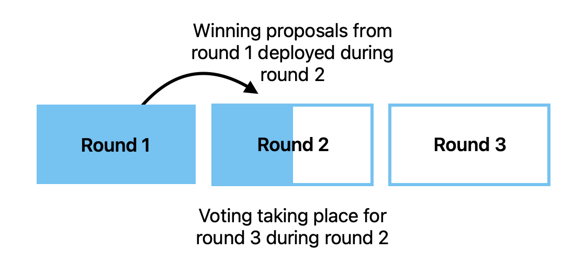
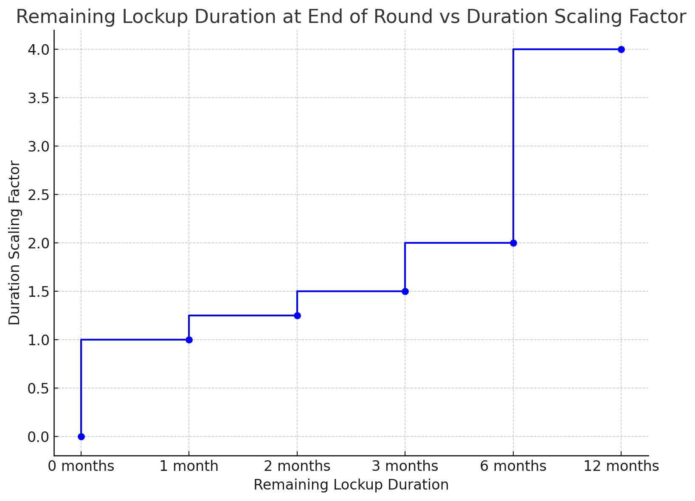

# Hydro technical spec

This is an overview of the core smart contracts that make up Hydro as of now.
Not all features from the original [litepaper](https://forum.cosmos.network/t/atom-wars-introducing-the-hydro-auction-platform/13842) are present in this version,
and some implementation details might lead to slightly different behavior than described in the litepaper.

# Protocol Owned Liquidity

Hydro is a system where Atom stakers can lock up their staked Atoms in exchange for voting power, which they can use to vote on proposals to deploy Atoms owned by the community pool into liquidity (aka market-making) positions on various decentralized exchanges.
The liquidity itself is still owned by the Cosmos Hub, thus this is a way of deploying Protocol Owned Liquditiy (PoL).

Like other “___ Wars” competitions, Hydro uses the concept of “gauges”- deployed liquidity is split between proposals proportional to the number of votes that they receive, instead of a winner-takes-all approach.

Atom is commonly used to enter and exit positions of other Cosmos tokens. Supplying more liquidity will help to cement Atom’s role as interchain money. The competition in Hydro to secure these PoL spots will generate excitement around Atom, and incentivize holders to lock it up.

Projects using the Cosmos Hub’s Interchain Security platform will receive a gauge multiplier. For a given percentage of the vote, they will receive a higher percentage of the deployed PoL.

The advantage of PoL compared to issuing incentives (i.e. paying rewards to liquidity providers in certain pools) is that
the community pool does not *spend* its funds, but rather deploys them. This means that the funds can be re-used in the future, and the community pool can grow over time.

# Main features

The main features of the Hydro smart contract are as follows:

## Locking

Users can lock their Atoms in the Hydro smart contract to receive voting power. Concretely, users can lock liquid staking module shares aka LSM shares in Hydro. Each LSM share represents a staked Atom that is delegated to a certain validator. Learn more about the Liquid Staking Module [here](https://github.com/iqlusioninc/liquidity-staking-module).
This means users that currently have liquid Atom tokens first need to stake their tokens before they can lock them in Hydro.
There are different locking durations available, and the longer the duration, the more voting power the user receives.
Currently, the different options for locking are 1, 2, 3, 6, and 12 months.
Once the locking period is over, the user can unlock their locked tokens and will receive the original amount of tokens back.

It is also possible to refresh a partially expired lockup to gain more voting power (read more about *Voting* below).

For security reasons, there is also a maximal number of LSM shares that can be locked in the contract. This number can be updated by the whitelist admin (see more in the section on the "Permission structure" below).

## Tranches, Rounds, Proposals

The Hydro contract supports multiple tranches.
In practice, there will be a general tranche accessible to all projects, and a tranche for projects using the Interchain Security platform.

Projects can submit proposals. These proposals are submitted during the current round, with rounds lasting for a certain amount of time,
currently set to 1 month.
For spam avoidance, only whitelisted accounts can submit proposals (see more in the section on the "Permission structure" below).
Each proposal will be submitted in a specific tranche, and this tranche can just be picked by the submitter.

During round N, the PoL from the community pool is deployed according to the results of voting from round N-1.



## Voting

Users that have locked tokens in Hydro can vote on proposals to decide how to deploy the community pool funds.
The voting power of a user is calculated as
```
voting_power = locked_atom * duration_scaling_factor
```
where `duration_scaling_factor` is a factor that depends on the amount of time that is left on the lockup *at the end of the current round*.
The `duration_scaling_factor` is given as:
| Remaining Lockup Duration | Duration Scaling Factor |
|---------------------------|-------------------------|
| >0 months                   | 1                       |
| >1 month                  | 1.25                    |
| >2 months                  | 1.5                     |
| >3 months                  | 2                       |
| >6 months                 | 4                       |

Notice this means that a users voting power decays over time in steps, and behaves like this:



Each user can vote for one proposal during each round and in each tranche. Users can switch their votes as often as they want.
The score of a proposal is the sum of the voting power of all users that voted for it.

# Liquid staking module and shares

It was already mentioned that users can lock LSM shares.
We need to give a bit of background to explain one particularity that this has for the Hydro contract.

Namely, an LSM share represents one share of a validator, and thus a claim to a part of the underlying Atom of that validator.

However, one LSM share does *not* represent one staked Atom directly.
Instead, different validators have different ratios of share<>staked Atom (we call this the "power ratio").
This means that the Hydro contract needs to keep track of the power ratios of all validators that users can lock tokens from.
Additionally, in the worst case we need to iterate over all the different validators that users hold tokens from
to calculate the voting power of a user and the scores of proposals.

This introduces two complexities:
* We have to restrict the set of validators that users can lock LSM shares from (to avoid a DoS vector)
* We have to keep track of the power ratios of all validators that users can lock LSM shares from, and regularly update them in case they change (so that voting powers are calculated correctly)

We solve both by utilizing Interchain Queries (learn more about what those are [here](https://docs.neutron.org/neutron/modules/interchain-queries/overview/)).
The Hydro contract keeps a list of validators, which are the validators that users can currently lock shares from.
Anyone can permissionlessly submit a transaction to make the Hydro contract *create* an Interchain Query for a new validator (and the submitter has to pay the query creation deposit to do so).
Then, the Hydro contract will periodically receive results about the voting power ratio of that validator.

However, Hydro also keeps, for each validator, the number of tokens delegated to that validator on the Cosmos Hub, and at any point in time,
it will only keep queries for the 500 validators with the most delegated tokens it knows about.
Other queries are removed, and the Hydro contract will keep the query creation deposits that it recovers in this manner.

# Permission structure

There are three different types of permissioned addresses in the Hydro contract:

1. **Whitelist admin**: The main responsibility of the whitelist admin is managing the other two types of permissioned addresses, and pausing the contract. It is also capable of updating the maximal number of tokens that can be locked in the contract.
2. **Whitelisted addresses**: These addresses can submit proposals.
3. **ICQ Managers**: These addresses can create Interchain Queries for validators, but *without* sending along the funds to pay for query creation. This means the contracts funds (for example, the funds that the contract kept from removing old queries) are used to pay for the query creation. ICQ managers can also withdraw the native denom from the contract. Notably, this means that ICQ managers *cannot* withdraw the LSM shares locked by users, since they can only withdraw the native denom (for example, untrn).

### Pausing/Un-pausing of the contract
In case of emergency, any whitelist admin will be able to suspend any actions on the smart contract by submitting the Pause transaction to the smart contract. Once the contract is paused, it can be un-paused through the Cosmos Hub governance by submitting the proposal to migrate the contract state (potentially to the same Code ID, in case the contract is safe to unpause without any changes to the code). Such proposal execution will trigger the `migrate()` function on the new contract code. This function will un-pause the contract and allow normal functioning of the contract to continue.
For more information on contract upgrade through the Cosmos Hub governance see [here](./docs/contract_upgrade.md).