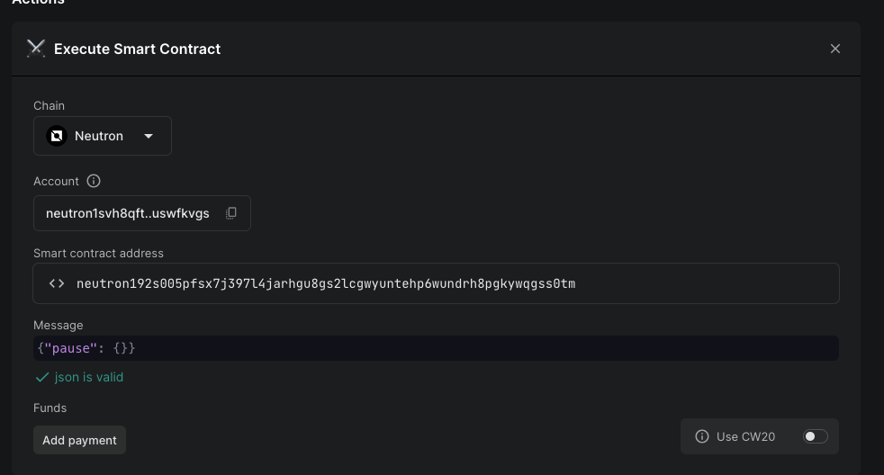

# Technical Guides for the Oversight Committee

The oversight committee has a few main tasks they have to interact with the Hydro contract for:
* Adding/Removing accounts from the whitelist or the ICQ managers
* Pausing/unpausing the contract
* Updating the maximal number of tokens that can be locked in the contract
* Querying the top N proposals

For general information on how to interact with CosmWasm contracts, see the [wasmd documentation](https://docs.cosmwasm.com/wasmd/getting-started/cli#execution).

## Executing Transactions

To execute messages via DAODAO (which is how the committee will interact with the contract), you have to create an "Execute Smart Contract" proposal on the DAODAO interface.
In the message, you need to fill in the correct message.

The messages can be seen in the [Hydro contract](../contracts/hydro/src/msg.rs) in the `ExecuteMsg` enum.
For example, to pause the contract, the message looks like this:
```
{"pause": {}}
```
In the DAODAO interface, it looks like this:


## Querying the contract

Querying the contract does not need to go through DAODAO, since every committee member can just query the contract directly
and verify the results.

This is how you can query the top N proposals using the command line (make sure to put the right contract address and query parameters):
```bash
neutrond q wasm contract-state smart neutron192s005pfsx7j397l4jarhgu8gs2lcgwyuntehp6wundrh8pgkywqgss0tm "{\"top_n_proposals\": {\"round_id\": 0, \"tranche_id\": 1, \"number_of_proposals\": 5}}"
```