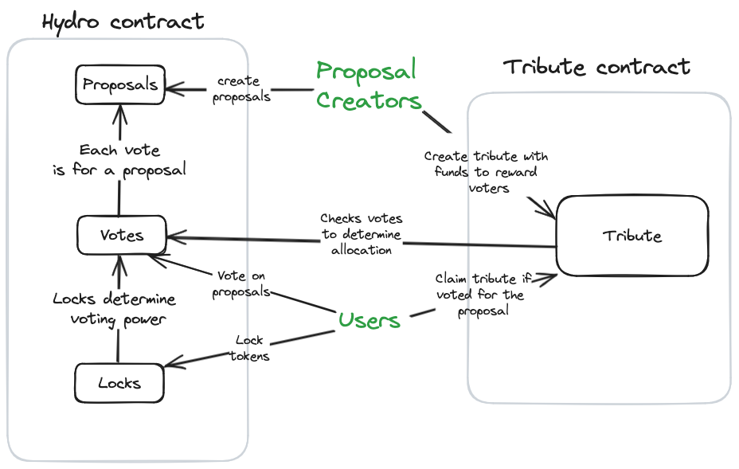

# Hydro: Technical Specification
This document describes the technical specification of the Hydro protocol. 

The state that Hydro keeps can be found in [`../contracts/atom_wars/src/state.rs`](../contracts/atom_wars/src/state.rs).
and [`../contracts/tribute/state.rs`](../contracts/tribute/state.rs).

Let us first give a high-level overview of the functionality.



Hydro allows users to lock tokens for a specified duration, and then vote on user-submitted proposals, with voting power depending on the
duration of the lock and the number of tokens locked.
Voting happens in rounds, each of which has a fixed duration.
Further, there are multiple tranches, each of which has its own set of proposals, and each user can vote once for each tranche.
Hydro also allows setting a whitelist of proposals which are acceptable, filtered on certain parameters in the proposal.
For example, the parameters might be a pool ID on a DEX, a specific IBC channel over which to send tokens, etc.


Additionally, anyone can submit *Tribute* for a proposal, which will be distributed to whoever voted on the proposal.
The *Tribute* contract is a separate contract that interacts with the Hydro contract, and anyone can permissionlessly deploy their own, alternative
Tribute contract by querying votes and proposals from Hydro.

We assume that outside of Hydro, there is a separate contract that manages some funds which will be deployed according to
the voting results aggregated by Hydro, but importantly, *the Hydro contract is agnostic to this*.
This contract specifically only manages user locks, proposals, tribute, and voting.
The actual fund distribution is done outside the Hydro contract. Due to this separation, funds could also be distributed by a trusted multisig instead of a smart contract, or any other mechanism.

In the following, we give the technical specification of the Hydro contract.
We group methods by functionality.
We focus on the high-level concepts here, so datatypes are idealized (i.e. `Time` might be represented as a `u64` representing nanoseconds in the actual implementation).

### Locks

#### `LockTokens(sender: Account, tokens: Coin, lock_duration: Time)`
Locks the given tokens for the duration.
In the code, this creates a lock entry in the state, with the `sender`, `tokens`, `lock_end` (computed as `current_time` + `lock_duration`), and `lock_id`.
In the current implementation, the tokens must be stAtoms only.
The locked tokens will be held in escrow until they are reclaimed (see UnlockTokens).

#### `RelockTokens(sender: Account, lock_id: int, new_lock_duration: Time)`
Lets a user refresh the duration of an existing lock.
The sender **must** be the account that created the original lock.
The `new_lock_duration` must be greater than the remaining time of the original lock, that is, it is not allowed to shorten the lock duration
with this function.

#### `ReclaimUnlockedTokens(sender: Account)`
For each lock created by the `sender` where `lock_end` is in the past, this function sends the tokens back to the sender and deletes the lock.
However, if the user has voted on a proposal during the last round, any tokens are not reclaimable until the round is over.
Thus, the user can reclaim tokens only if they have not voted in the last round.
In general, this means that users should first reclaim their tokens before voting.

### Proposals
#### `SubmitProposal(metadata: CovenantParameters, tranche_id: int)`
Submits a new proposal in the current round and the given tranche.
The `metadata` is a struct that contains the parameters of the proposal.
TODO: entry fee

#### `Vote(sender: Account, proposal_id: int)`
Adds the sender's voting power to the score of the proposal with the given `proposal_id`.
If the sender already voted in the tranche that proposal is in, the previous vote is overwritten.
The voting power is computed as a function of the remaining lock duration when the current round ends and the number of tokens locked, specifically
`voting_power = \sum_{lock \in locks created by the sender} lock.tokens * power_factor(lock.lock_end - current_round_end)`,
where `power_factor` is defined as:
```
power_factor(remaining_lock_time) = 
    * 0 if remaining_lock_time <= 0
    * 1 if 0 < remaining_lock_time <= 1 month
    * 1.5 if 1 month < remaining_lock_time <= 3 months
    * 2 if 3 months < remaining_lock_time <= 6 months
    * 4 if remaining_lock_time >= 6 months
```


### Whitelist

Hydro keeps a whitelist of what metadata is appropriate for proposals (e.g. to which liquidity pools can funding be deployed).
This whitelist can be updated by a specific address which is set on contract creation, so all methods in this section
require the sender to be this address.
When querying the scores of proposals, the whitelist is checked to filter out proposals that are not whitelisted.

#### `AddToWhiteList(sender: Account, metadata: CovenantParameters)`
Adds the given metadata to the whitelist.

#### `RemoveFromWhiteList(sender: Account, metadata: CovenantParameters)`
Removes the given metadata from the whitelist.

### Tribute

Hydro provides a standard Tribute implementation, which should be appropriate for many cases.

#### `LockTribute(sender: Account, tokens: Coin, proposal_id: int)`
Locks the given tokens for the given `proposal_id`. Can only be done while the round this proposal is in is ongoing.

#### `ClaimTribute(sender: Account, tribute_id: int)`
After the round is over, the sender can claim their share of the tribute. The share is proportional to the proportion of the power of the
sender's vote to the total power of the votes for the proposal, e.g. if the sender contributed 10% of the voting power, they can claim 10% of the tribute.

For spam prevention, we assume that only the top N proposals are counted in the outcome, where N is a parameter of the contract and
assumed to be large.
If a proposal is not in the top N, the tribute is not actually claimable, but can be reclaimed (see below).

#### `RefundTribute(sender: Account, tribute_id: int)`
If the proposal associated with the tribute_id received no support at all, the sender can reclaim their tokens.


### Correctness Properties

* The score of a proposal should be the sum of the lock-weighted tokens that voted for it.

* For every tranche, the total voting power should be at most the total lock_weighted locked tokens.

* If a user locks during round R for M rounds, they should have exactly M rounds of non-zero voting power from these tokens: R, R+1, ..., R+M-1

* The voting power of locked tokens where current_round >= lock_end_round is zero.

* If tokens contribute voting power to a proposal in round R, they should not be reclaimable until round R+1 is over
We assume that some liquidity is deployed according to the voting results of round R, and this liquidity will be deployed until voting for round R+1 is over.
Thus, this mechanism keeps the tokens locked until the deployment for round R is over, and thus the tokens are still attributable and could be slashed via
social consensus in extreme cases.

* If all proposals that the owner of a lock has voted for are resolved and the lock_end_round is in the past, the tokens should be reclaimable.

* After the round is over, the powers for proposals, the total power, etc should all be frozen and cannot be updated.

* If tokens are locked at time t for a duration d, there should be no way to reclaim these tokens before t+d.

* During a round, tributes for proposals in that round can never be deleted or decrease in token amount, only new tributes can be added.

* After a round has ended, no new tributes can be added for proposals in that round.

In consequence, over a round, the total number of locked tokens in tributes can only increase.
After the round is over, the total number of locked tokens can only decrease.

* If a proposal is not in the top N proposals, the tribute should be refundable.

* If a proposal does not get any votes at all, the tribute should be refundable.

* The sum of the claimed tokens for a tribute should be at most the total tokens locked for the tribute.

* For any tribute, after the round of the proposal the tribute is for ends, it should hold that *either* the tribute is refundable by the sender, or it is claimable by the voters. It should never be the case that some address can claim a tribute, but also that same tribute is refundable, and neither should a tribute be both *not* refundable and *not* claimable.